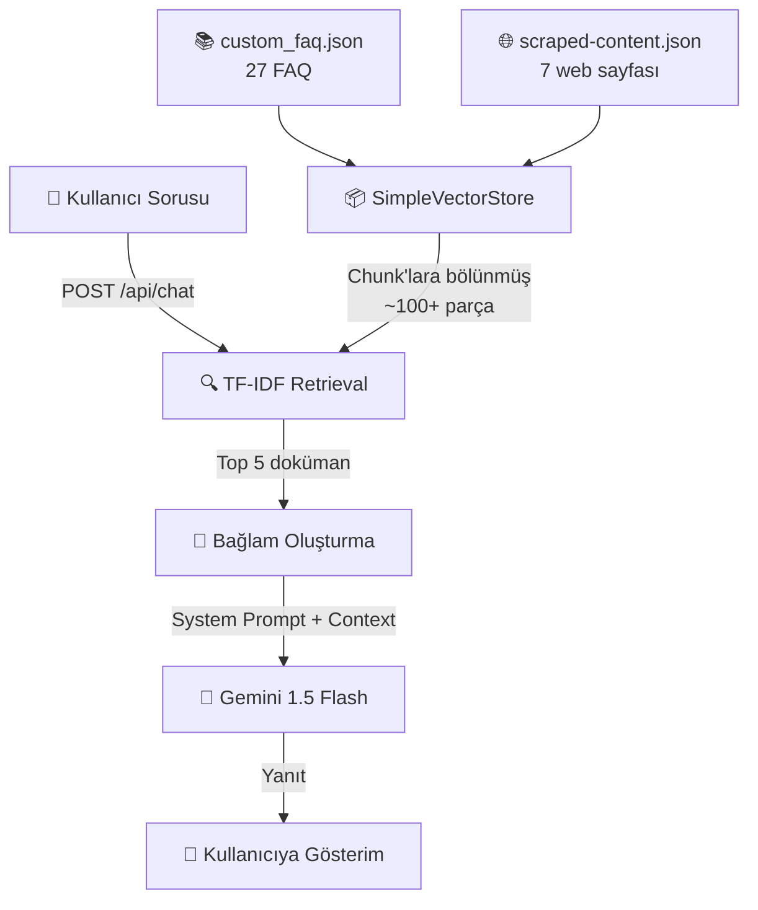

# 📚 IE 304 - Proje 1: Akıllı Chatbot Uygulaması — Proje Analizi

## 📋 Ödev Gereksinimleri (IE304_Project1.pdf Özeti)

| Bilgi | Detay |
|-------|-------|
| **Ders** | IE 304 — ODTÜ Endüstri Mühendisliği |
| **Proje** | Proje 1 — Akıllı Chatbot Uygulaması |
| **Teslim Tarihi** | 12 Nisan 2026, Pazar, 23:59 |
| **Proje Türü** | Grup projesi |

### Proje Amacı
ODTÜ Endüstri Mühendisliği **Yaz Stajı** (Summer Practice) konusunda öğrencilere yardımcı olacak **akıllı bir chatbot** geliştirmek. Chatbot, resmi bölüm prosedürleri ve kılavuzlarına dayalı doğru ve güvenilir bilgi sağlayan bir **sanal danışman** olarak çalışacak.

### Teslim Edilmesi Gerekenler

| # | Bileşen | Açıklama |
|---|---------|----------|
| A | **Proje Dokümantasyonu** | 1-2 sayfa PDF: Sistem mimarisi, 3-5 test sorgusu, kullanıcı kılavuzu |
| B | **AI Etkileşim Logları** | ChatGPT/Claude paylaşılabilir link (geliştirme sürecinin belgelenmesi) |
| C | **Canlı Chatbot** | Vercel/Streamlit gibi bir platformda deploy edilmiş, URL üzerinden erişilebilir web uygulaması |
| D | **Kaynak Kod** | Tüm kaynak kodlar |

### Değerlendirme Kriterleri
1. **Teknik Dağıtım** — Uygulama bulutta başarıyla barındırılmış ve tam işlevsel mi?
2. **Bağlamsal Bütünlük** — Chatbot, resmi SP-IE web sitesine dayalı doğru yanıtlar sunuyor mu?
3. **Kapsam Dışı Sorgular** — Bot, ODTÜ-IE Yaz Stajı dışındaki soruları nasıl yönetiyor?

---

## 🏗️ Proje Yapısı

```
ie304-project/
├── app/                          # Next.js App Router
│   ├── api/
│   │   └── chat/
│   │       └── route.ts          # Chat API endpoint (RAG pipeline)
│   ├── globals.css               # Global stiller (Material Design 3 teması)
│   ├── layout.tsx                # Root layout (Google Fonts: Public Sans, Inter)
│   ├── page.tsx                  # Ana sayfa — Chat UI bileşeni
│   └── favicon.ico
├── data/
│   ├── custom_faq.json           # 27 özel FAQ girişi
│   └── scraped-content.json      # SP web sitesinden kazınmış içerik (7 sayfa)
├── lib/
│   └── vectorstore.ts            # TF-IDF tabanlı retrieval engine
├── added_files/
│   ├── Sp-opportunities.txt      # Güncel SP fırsatları
│   ├── Previous-spopportunities.txt  # Önceki yıl fırsatları
│   └── informationaboutfiles.txt # SP web sitesi döküman listesi
├── public/                       # Statik dosyalar (SVG ikonlar)
├── .env.local                    # API anahtarı (GOOGLE_API_KEY)
├── package.json                  # Bağımlılıklar
├── SYSTEM_REPORT.md              # Detaylı sistem raporu
├── IE304_Project1.pdf            # Ödev sorusu
└── ...config dosyaları
```

---

## ⚙️ Teknoloji Yığını

| Katman | Teknoloji | Versiyon |
|--------|-----------|----------|
| **Frontend Framework** | Next.js (App Router) | 16.2.3 |
| **UI Kütüphanesi** | React | 19.2.4 |
| **CSS Framework** | Tailwind CSS | 4 |
| **İkonlar** | Lucide React | 1.8.0 |
| **LLM** | Google Generative AI (Gemini 1.5 Flash) | — |
| **LLM Entegrasyonu** | LangChain.js | 1.3.1 |
| **Metin İşleme** | @langchain/textsplitters | 1.0.1 |
| **Web Scraping** | Cheerio | 1.2.0 |
| **Dil** | TypeScript | 5 |

---

## 🧠 Sistem Mimarisi (RAG Pipeline)



### Detaylı Akış

1. **Veri Hazırlığı** (Uygulama başlangıcında bir kez çalışır):
   - `scraped-content.json` (7 web sayfası) ve `custom_faq.json` (27 FAQ) `Document` nesnelerine dönüştürülür
   - `RecursiveCharacterTextSplitter` ile 500 karakter chunk'lara bölünür (50 karakter overlap)
   - Her chunk tokenize edilir → TF-IDF indeksi oluşturulur

2. **Sorgulama** (Her kullanıcı mesajında):
   - Kullanıcı mesajı tokenize edilir
   - TF-IDF skoru hesaplanır: `TF(token) × IDF(token)`
   - Tam eşleşme bonusu: +10 puan
   - En yüksek 5 skor alan doküman seçilir

3. **Yanıt Üretimi**:
   - System prompt + seçilen dokümanlar → Gemini 1.5 Flash'a gönderilir
   - `temperature: 0.3` ile düşük yaratıcılık (doğruluk odaklı)
   - Yanıt JSON olarak frontend'e döner

---

## 🎨 Kullanıcı Arayüzü

### Tasarım Sistemi
- **Material Design 3** ilham alınmış tema
- **Renk paleti**: ODTÜ kırmızısı (`#b6000e`, `#e30a17`) bazlı gradient
- **Fontlar**: Public Sans (başlıklar), Inter (gövde metni)
- **Efektler**: Glassmorphism, custom shadow'lar, typing animasyonu

### Özellikler
- **Sidebar**: Navigasyon, yeni chat butonu, kullanıcı profili
- **Karşılama ekranı**: 3 öneri sorgusu butonu
- **Chat arayüzü**: Kullanıcı/bot mesajları ayrı stillerle
- **Responsive**: Mobil için sidebar overlay desteği
- **Auto-resize textarea**: Çoklu satır input desteği
- **Typing animasyonu**: Bot yanıt verirken bounce-dot animasyonu

---

## 📊 Bilgi Tabanı Detayları

### Kazınmış Web İçeriği (`scraped-content.json`)

| # | Sayfa | URL |
|---|-------|-----|
| 1 | Ana Sayfa | `sp-ie.metu.edu.tr/en` |
| 2 | Genel Bilgi | `sp-ie.metu.edu.tr/en/general-information` |
| 3 | Takip Edilecek Adımlar | `sp-ie.metu.edu.tr/en/steps-follow` |
| 4 | SSS | `sp-ie.metu.edu.tr/en/faq` |
| 5 | SP Komitesi | `sp-ie.metu.edu.tr/en/sp-committee` |
| 6 | IE 300 Tanıtım | `sp-ie.metu.edu.tr/en/ie300-introductory-session` |
| 7 | IE 400 Tanıtım | `sp-ie.metu.edu.tr/en/ie400-introductory-session` |
| 8 | SP Fırsatları | `sp-ie.metu.edu.tr/en/sp-opportunities` |

### Özel FAQ Veritabanı (`custom_faq.json`) — 27 Giriş

Kapsanan konular:
- IE 300/400 tanımları ve ön koşulları
- Staj süresi gereksinimleri
- SGK sigortası başvuru süreci ve zamanlaması
- Gerekli belgeler (8 adet)
- Kabul edilen şirket türleri (IE 300 vs IE 400)
- Staj dönemleri ve rapor teslim tarihi (24 Ekim 2025)
- Grup/proje bazlı IE 400 seçenekleri
- Yurtdışı staj (Erasmus)
- Ücretli staj prosedürleri
- Gönüllü staj kuralları
- Sistem Tasarımı projesi
- Güncel SP fırsatları (17+ şirket)
- AI içerik kontrolü ve plagiarism
- SP Komitesi iletişim bilgileri

---

## 🔑 Kritik Tasarım Kararları

### ✅ TF-IDF Tabanlı Retrieval (Embedding Yerine)
- **Neden**: Sıfır API maliyeti, hızlı yanıt süresi (<50ms), deterministik sonuçlar
- **Dezavantaj**: Semantik ilişkileri yakalayamayabilir (keyword bazlı)
- **Stopword listesi**: 46 terim (İngilizce yaygın kelimeler + IE-spesifik: ie, ie300, ie400)

### ✅ Gemini 1.5 Flash (LLM)
- **Neden**: Hızlı yanıt, düşük maliyet, Türkçe/İngilizce çoklu dil desteği
- **Temperature**: 0.3 (düşük yaratıcılık = yüksek doğruluk)

### ✅ Stateless Mimari
- Konuşma geçmişi tutulmuyor (her sorguda sadece son mesaj gönderiliyor)
- Frontend'de mesaj geçmişi görüntüleniyor ama API'ye sadece son mesaj iletiliyor

---

## 🧪 Test Senaryoları (SYSTEM_REPORT.md'den)

| # | Sorgu | Beklenen Davranış |
|---|-------|-------------------|
| 1 | "What are the prerequisites for IE 300?" | Ön koşul derslerini listeler |
| 2 | "What documents do I need?" | 8 gerekli belgeyi sıralar |
| 3 | "What types of companies are accepted for IE 300?" | Üretim şirketlerini açıklar |
| 4 | "When should I apply for SGK insurance?" | 2-3 hafta öncesinden başvuru |
| 5 | "What's the weather like today?" | Kapsam dışı — kibarca reddeder |
| 6 | "Can I do my internship abroad?" | Erasmus programını açıklar |

---

## 🚀 Çalıştırma

```bash
# Bağımlılıkları yükle
npm install

# API anahtarını ayarla
echo 'GOOGLE_API_KEY=your_key' > .env.local

# Geliştirme sunucusunu başlat
npm run dev

# http://localhost:3000 adresinde erişilebilir
```

---

## 📈 İstatistikler

| Metrik | Değer |
|--------|-------|
| Toplam FAQ girişi | 27 |
| Kazınmış web sayfası | 8 |
| Toplam şirket | 30+ |
| Doküman chunk sayısı | ~100+ |
| Ortalama retrieval süresi | <50ms |
| TF-IDF indeks boyutu | <1MB |
| Desteklenen diller | Türkçe, İngilizce |

---

## ⚠️ Mevcut Kısıtlamalar ve Geliştirme Fırsatları

| Durum | Konu | Açıklama |
|-------|------|----------|
| ⚠️ | Stateless konuşma | Önceki mesajlar bağlam olarak kullanılmıyor |
| ⚠️ | Keyword-bazlı retrieval | Semantik ilişkiler kaçırılabilir |
| ⚠️ | Tek dilli stopword listesi | Sadece İngilizce stopword'ler mevcut, Türkçe yok |
| ✅ | Sıfır retrieval maliyeti | TF-IDF tamamen yerel |
| ✅ | Çoklu dil yanıtı | Gemini Türkçe/İngilizce otomatik algılıyor |
| ✅ | Kapsam dışı sorgu yönetimi | System prompt ile sıkı kontrol |
